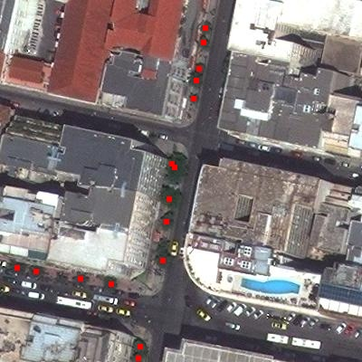
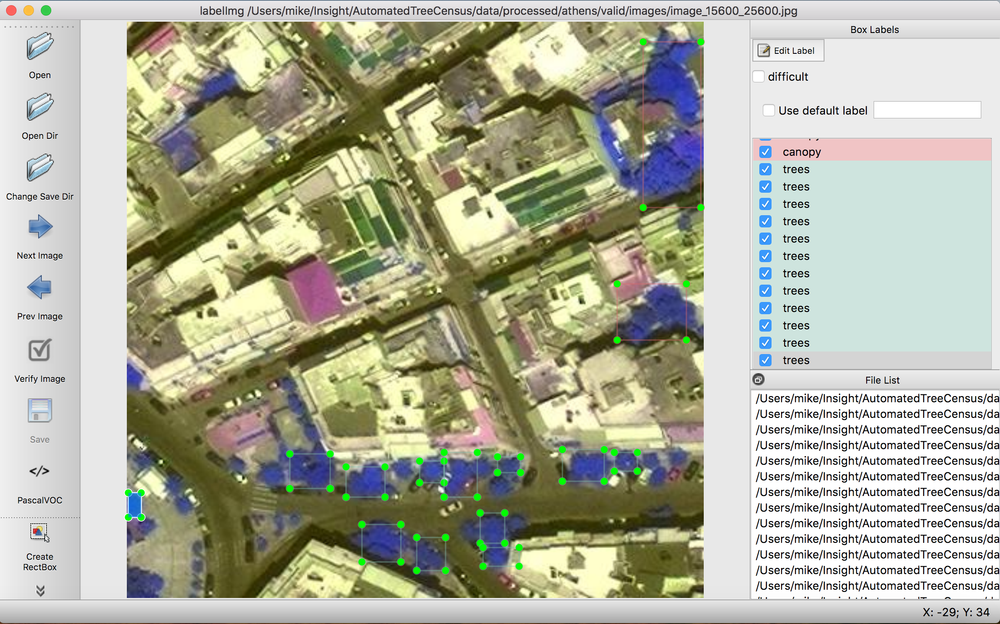
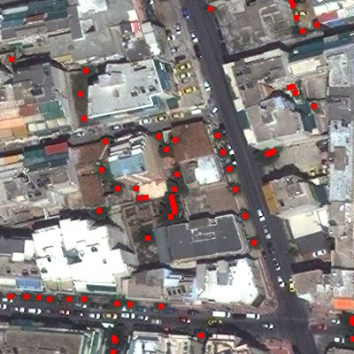
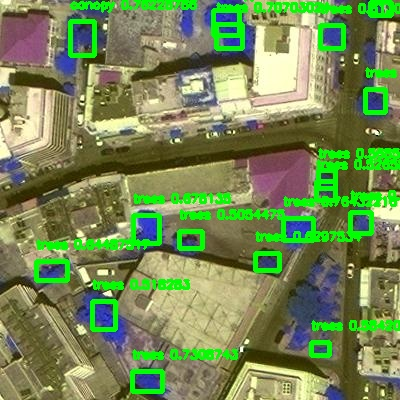

# Canopy: an automated tree census


A google slide presentation for my Insight project can be found [here](https://docs.google.com/presentation/d/1hJy6QlZ1l-aOmU88pd-6kLe2fV3JfEG0gt8AKGEz_qs/edit?usp=sharing).

## Setup
Clone the repository and start the docker image. If you do not have docker, follow the [download instructions](https://docs.docker.com/install/).

```
git clone https://github.com/mstefferson/Canopy
cd Canopy
docker pull mstefferson/tree_bot:latest
./run_docker
```

Additional info can be found in the [Additional build info](#add_build_info) section.

## Test inference
Run a test inference on the example data set

Build sample dataset from tif:

```
./executables/build_tif_dataset_example
```
This should put images in folders ./data/processed/examples/(train, valid, predict)

Run pixpeak detection on the images in the predict folder (no training needed)

```
./executables/predict_example
```

The image in ./data/processed/example/predict/images\_detected/image\_000\_000\_detected.jpg should look like this:



The bounding box results for all the images are in ./data/processed/example/predict/bb\_info. To compile all results into a .csv, run

```
./executables/compile_results_example
```

Take a look at the tree report in ./tree_locations/tree\_loc\_example.csv.


## How machine learning can keep cities green
Cities receive enormous benfits from the trees within them---from carbon sequestration to quality of life improvement---and these benefits directly lead to finacial returns for a city. To maximize these returns, cities conduct tree censuses, which require thousands of man hours. I've built a platform for automating this process by detecting trees from satellite images.


This repo contains code to predict the locations of trees from a satellite tif image. This work was for a consulting project for the city of Athens, Greece, which I worked on as an Insight AI Fellow. 
I have designed a pipeline for analyzing 4-channel GIS satellite images (tif files) that other cities and engineers should feel free to use!


## Data
### Satellite tif
The raw data I was given was a single tif file with four channel's (R, G, B, IR) of all of Athens. Since I do not own the data, I cannot post it. However, I designed everything so it should be straightforward to use everything on a novel dataset.

It should be straightforward to use this repo on new satellite data in the form of a .tif file. I self-labeled 100 400x400x3 (r, g, IR) images.  To label data, I used [labelImg](https://github.com/tzutalin/labelImg).

### DSTL
Unless you have a ton of pre-labeled data, I'd recommend pre-training on Kaggle's DSTL
[Kaggle's DSTL challenge](https://www.kaggle.com/c/dstl-satellite-imagery-feature-detection) if you're using the yolo2 model. 


#### Prepping DSTL data

This repo can take the DSTL, and process it to a useable format for training. It breaks up the giant tif files into smaller pngs, grabs the labels out of the geojson files, and puts them into a usable format. Currently, the model uses VOC label format, but the code can produce YOLO label format as well.

To prep data:

- Download the DSTL [data](https://www.kaggle.com/c/dstl-satellite-imagery-feature-detection/data)
- Unzip and place all of the contents in the data path of your liking. I recommend data/raw/dstl
- Feel free to delete the 16 band data, I don't use it
- Edit config file, configs/config\_build\_dstl.json so that it includes the correct paths
- Start a Docker container
- Run the code to clean the data

```
./executables/build_dstl_dataset
```

Note, to predict on DSTL, you may need to change permission on directory.

#### Prepping your data

Since I was using Athen's dataset, I used the config file config\_satfile\_athens.json.  To run on your own dataset, feel free to just edit that config file or make a new one. I will reference everything from here on out as using the Athen's dataset. To build a predict, train, validation set, simply edit configs/config\_satfile\_athens.json.

- Edit config file, configs/config_satfile.json so that it includes the correct paths
	- See  src/preprocess/build\_tif\_datasets.py and src/sat_class.py for the description of the parameters
- Be careful with erasing old data if the erase flag is set!
- Start a Docker container
- Run the code to clean the data

```
./executables/build_tif_dataset
```

- I self labeled 100 images for "trees" and "canopy" for my dataset using [labelImg](https://github.com/tzutalin/labelImg). An example is show below:



## Train

Here, I provide instruction on how to train on the Athen's dataset. It should be straightforward to mirror these instructions for your own dataset.

I have implemented a Keras version of yolo_v2, which I adapted, with edits, from [experiencor/keras-yolo2](https://github.com/experiencor/keras-yolo2). I implemented the updated [loss function](https://github.com/experiencor/keras-yolo2/issues/353) as well as documented and added additional features to the code. For backend weights, see their GitHub page.

The labels for training/prediction are "trees, canopy". Make sure to train the YOLO model on a GPU node! See my [AWS instructions](#aws_setup) below.

### YOLO

All training for YOLO was done on the AWS GPU node (see set-up). If you'd like, you can create new anchor boxes for the yolo model (or use mine). To
create new anchor boxes, open up a shell in docker and run

```
python src/models/gen_anchors_yolo.py \
-c configs/config_yolo_(dstl,athens).json
```

Copy and paste the output into the anchor box input in the config file

Now we ready to train. 

#### Train on dstl
The config file for training is config\_yolo\_dstl.json. This should be edited to have the correct paths and weight paths. Once edited, run:

```
./executables/train_yolo_dstl
```

#### Train on satellite tif file
Edit configs/config\_yolo\_athens.json to your paths and save names.  Once edited, run:

```
./executables/train_yolo_athens
```

#### Weights
If you'd like pre-trained weights, please send me a message

## Predictions

There are two models for prediction: pixelpeak and yolo2. These can be edited the prediction config config\_predict\_athens.json. 

### pixelpeak
In configs/config\_predict\_athens.json, change the model to "pixelpeak". pixelpeak only finds tree locations and no info on the size of the tree.

```
./executables/predict_athens
```

Here is a sample output from pixelpeak:


### YOLOv2
In configs/config\_predict\_athens.json, change the model to "yolo2". yolo2 finds "trees, canopy" classes locations and bounding box info

```
./executables/predict_athens
```

Here is a sample output from YOLOv2:



## Compiling results
The predictions are saved in /path/2/data/predict/bb\_info. This data can be compiled and stored in a csv. Edit the config file configs/config\_satfile.json to make sure your paths are correct. Running:

```
./executables/compile_results_athens
```

will compile the results. The a snapshot of final csv file looks something like this:


Here r,c\_global is the location of the images origin in the tif file, lon is longitude, lat is latitude, w\_meter is the tree width in meters, h\_meter is the tree height in meters.

## <a name="add_build_info"></a>Additional build info

### Docker
In order to interact with satellite data (both GIS shape files and tif images), we need to use GDAL (Geospatial Data Abstraction Library). I found the installation of this to be a bit of a pain, so I built a docker image. With the exception of training on a AWS GPU node, all code should be ran through the docker image. More details on training vs processing below.

This docker image is built from thinkwhere/gdal-python. It contains GDAL and many geospatial python libraries. It also supports Jupyter notebooks. 


With the exception of GPU training, building the docker image, and starting up a Docker container, all code should be ran within a Docker container. The docker images mounts the WD into the container.

The instructions above can pulls the docker image from my docker hub. It can also be built using using the docker file

``` bash
./build_docker
```
If you want use a Jupyter notebook, simply run the following bash script:

``` bash
./run_docker_jn
```

Note, the docker container is removed 

### <a name="aws_setup"></a>AWS set-up

I ran all training on an AWD instance: Deep Learning AMI (Ubuntu) Version 13.0 - ami-00499ff523cc859e6. I used GPU Compute node, p2.xlarge

Make sure the paths in the config file configs/config\_yolo*.json the paths should be relative to the current working director. **Do not put the full path.** The code handles the path up to the working directory. If the working directory is /path/2/wd/ and the data is located in wd/path/2/data, the 'path/2/data' should go in the config file.

Start up a Keras environment on an AWS.

```
source activate tensorflow-p36
pip -r build/requirements_aws.txt
```


## Sandbox
 Take a look at this  [example notebook](https://github.com/mstefferson/Canopy/blob/master/notebooks/pixpeak_from_tif_demo.ipynb) to see how to interact with a tif file, get a subset of data from it, run pixel_peak interactively and some visualization of results.
 
In addition, I have [building new tif file notebook](https://github.com/mstefferson/Canopy/blob/master/notebooks/build_tif_subset.ipynb) to see how to build tifs from pre-existing data. 
